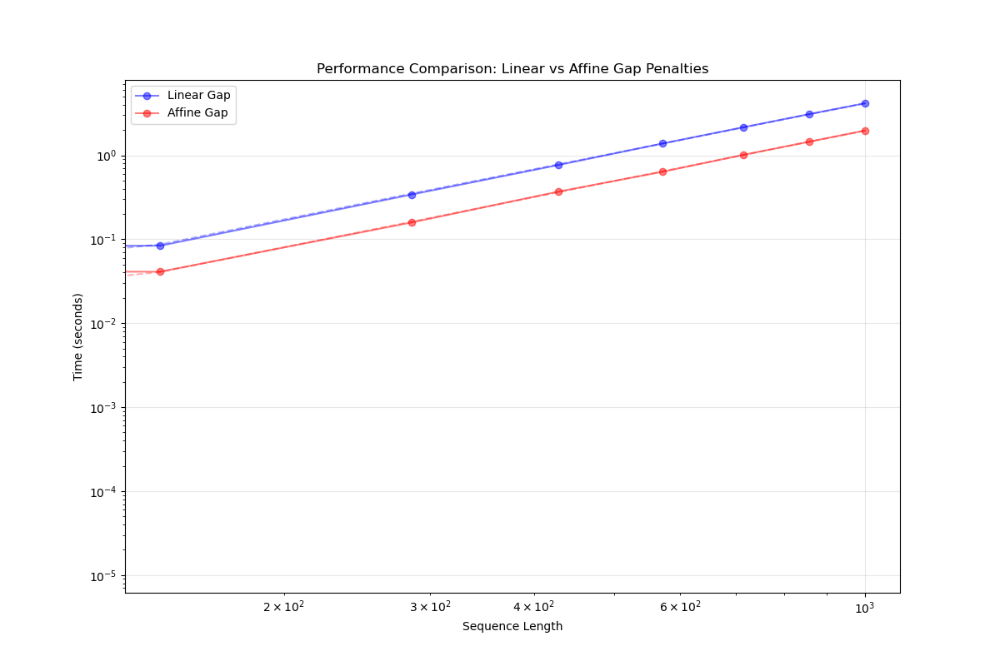

# Global alignment with different gap costs

## Introduction

The report summarizes the results of global alignment with both linear and affine gap costs with at most quadratic time and space complexity for the calculation of the optimal alignment costs. There is also a figure which depicts the the above, and compares the linear and affine implementations' time complexity. In addition, the answers for the questions (_project2_eval.txt_) can also be found. The implemented algorithms were tested for all the test cases that we were given in _project2_examples.txt_. We think everything works as expected. This report is/was also generated automatically by using snakemake.

## Methods

We have implemented global alignment algorithms with the possibility of using either linear or affine gap costs. Speaking of the linear gap cost algorithm, the implementation itself can be find in `scripts/global_linear.py`. There are two main differences between our algorithm and the one we were talking during the class. One of them is that we penalize mismatch and gap costs with higher score, therefore in the cost calculation we minimize the optimal cost rather than maximizing it as we have done in the class. The other difference is in the backtracking algorithm, where we not only retrieve one optimal alignment but rather all of the optimal alignment, thus it takes much more time for our backtracking algorithm to run. Some comments among the algorithms can be found to make it easier to understand.

Turning to the affine gap cost algorithm, the cost calculation part of the algorithm works almost exactly the same way we have discussed in the class, besides the S matrixes, where we store our optimal alignment scores, we introduced two new matrixes, namely D for tracking the deletions and I for the insertions. Instead of using an iterative backtracking algorithm for this we have used a recursive one, which also find all the optimal alignments as previously mentioned.

Although our backtracking algorithms have higher time complexities [$O(2^{n})$] than just getting a single optimal alignment [$O(n)$], the cost calculation parts are [$O(nm)$] for both time and space complexity for linear and affine gap costs as well. [n represents length of sequence1 and m represents length of sequence2 and assuming n > m]

Regarding the usage, at first you should create a conda environment with the following command while being in the main folder (project2): `conda env create -f environment.yml`, which will create a conda environment with the proper required packages. After running this command you can activate the newly created environment with the following: `conda activate alignment_plus`. Now you can simply
ask for help by running: `alignment_plus --help`. `alignment_plus --seq1 gcct --seq2 gggc --gap-model affine` is an example of running our program, --seq1 and --seq2 are required arguments, which can either be the sequence itself or a path to the sequence. This will write the analysis to the stdin of your shell, with a random optimal alignment, in case you define `--output-path` argument then all the optimal alignments are saved to the specified path as fasta file, e.g.: `alignment_plus --seq1 gcct --seq2 gggc --gap-model affine --output-path results/alignments/results.fasta`. The parameters can be modified in the `parameters/` folder, _score_matrix.csv_, and _gapextend_ are intuitive, _gapopen_ is the gap cost for the linear cost algorithm and also the gap opening cost for the affine.

This report itself can be regenerated by `snakemake --cores all`. You can also change the sequences you want to analyze by changing the sequences found in `data/sequences.fasta`.

## Tests

We have tested both of our algorithms by means of pytest, the actual tests can be found in the `tests/` folder, and you can simply run the tests by: `pytest`. The test cases includes all of the examples found in _project2_examples.txt_. The answers for _project2_eval.txt_:

## Sequence Alignment Analysiss

### Question 1

Linear gap cost alignment (g(k)=5\*k):

Optimal score: 226.0

Optimal alignment:

```
Aligned sequence 1 (105 bp):
tatgga-gagaataaaagaactgagagatct-aatgtcgcagtcccgcac
-tcgcgagatact-cactaagac-cactgtggaccatatggccataatca
aaaag
```

```
Aligned sequence 2 (105 bp):
-atggatgtcaatccga-ctctacttttcctaaaaattccagcgcaaaat
gccataag-caccacattcccttatactggagatcct-cca-tacagcca
tggaa
```

### Question 2

Affine gap cost alignment (g(k)=5+5k):

Optimal score: 266.0

Optimal alignment:

```
Aligned sequence 1 (103 bp):
tatggagagaataaaagaactgagagatct-aatgtcgcagtcccgcac-
tcgcgagatactcactaagac-cactgtggaccatatggccataatcaaa
aag
```

```
Aligned sequence 2 (103 bp):
-atggatgtcaatccgactctacttttcctaaaaattccagcgcaaaatg
ccataagcaccacattcccttatactggagatcctcca--tacagccatg
gaa
```

### Question 3

Score matrix for linear gap cost (g(k)=5k):

```
      seq1  seq2  seq3  seq4  seq5
seq1     0   226   206   202   209
seq2   226     0   239   223   220
seq3   206   239     0   219   205
seq4   202   223   219     0   210
seq5   209   220   205   210     0
```

### Question 4

Score matrix for affine gap cost (g(k)=5+5k):

```
      seq1  seq2  seq3  seq4  seq5
seq1     0   266   242   243   256
seq2   266     0   283   259   254
seq3   242   283     0   269   243
seq4   243   259   269     0   247
seq5   256   254   243   247     0
```

## Experiments

We have only created one figure which can be seen below [*Figure 1*]. This clearly shows us that both of our implementation follows a [$O(n^2)$] manner, although the affine cost calculation seems to be faster than the linear cost, and this is somewhat counterintuitive. Becuse in the affine algorithm besides the alignment cost matrixes we have two more additional ones (D and I), so filling them out require us more operations in theory. The reasoning behind this discrepancy might be the fact that we utilize more numpy operations in the linear implementation, which puts a bottleneck to that algorithm. The figure only shows the cost calculation, since our backtracking algorithms collect all the possible alignments, thus they have an exponential time complexity and with randomly generated sequences it would take so some time to finish, therefore we decided not to analyze it.


