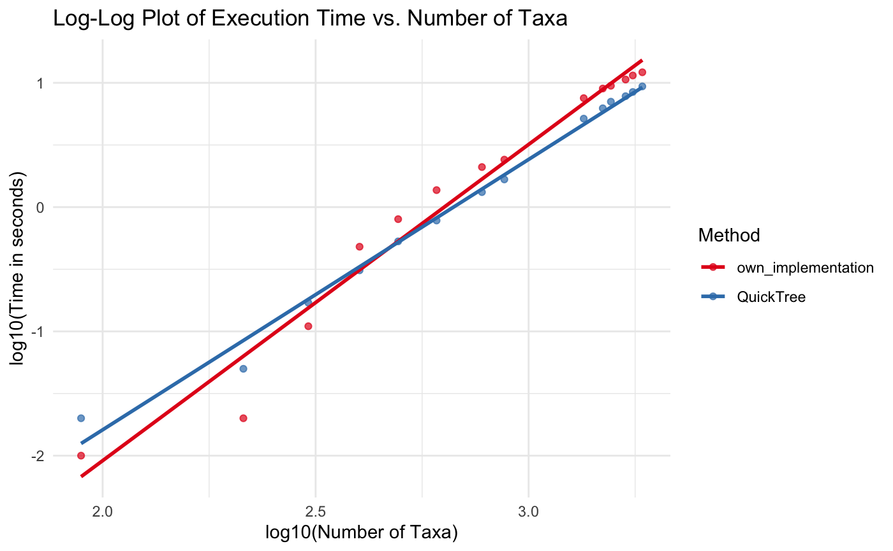

# NJ tree construction

## Introduction

Our implementation works well with the `example_slide4.phy` test case, it produces the same tree as on slide 4. The code is written in Go, and most of the functions are tested. Regarding the usage, there is a _data/_ folder with the 14 distance matrixes in phylip-format (_unique_distance_matrices.zip_), and there should be an empty _result/_ folder. By running the `./nj` command our program should generate a tree in Newick format for all the input files found in the _data/_ folder, as well as a _times.csv_ file, which includes the execution times for both our implementation (Go) and the quicktree-2.5 (C implementation). Unfortunately I couldn't comiple the rapidnj-2.3.3, because of the Apple Silicon chip.

## Implementation

We have used the Go programming language to make it more efficient, the implementation follows the ideas shown on slide 50. At first we have implemented a parser function, which is used to parse the phylip-format to a struct, and this is basically the input of the `NeiSaitou` function. At first we have tried rebuilding the dissimilarity matrix after every iteration of pairing two taxas, specifically stated in the while loop point 4. (slide 50), but it turned out to be really inefficient, thus the current implementation doesn't rebuild the dissimilarity matrix, but rather chooses one of the selected taxa to be deactivated, and recalculate the distances in the other taxa's column and row. Besides this we also save the row sums in a data structure and only recalculates the rows after each iteration. At the end of the algorithm when we have only 3 taxas we followed the same rule as in the slides, therefore we always get a tree with 3 children (right after the `root`), so basically an unrooted tree. Right after this we generate a Newick tree format from our tree structure.
 

## Summary

The machine parameters are the following: CPU: Apple Silicon M1, RAM: 8GB, OS: MacOS. Our implementation is slightly worse the the quicktree one, and this can be seen below [*Figure 1*]

Here is the summary table:

| Input File                   | QuickTree (sec) | Own Implementation (sec) | Speed-up |
| ---------------------------- | --------------- | ------------------------ | -------- |
| 89_Adeno_E3_CR1.phy          | 0.09            | 0.03                     | 3.00     |
| 304_A1_Propeptide.phy        | 0.24            | 0.26                     | 0.92     |
| 214_Arena_glycoprot.phy      | 0.12            | 0.21                     | 0.57     |
| 401_DDE.phy                  | 0.38            | 0.34                     | 1.12     |
| 494_Astro_capsid.phy         | 0.51            | 0.63                     | 0.81     |
| 608_Gemini_AL2.phy           | 0.75            | 1.23                     | 0.61     |
| 777_Gemini_V1.phy            | 1.09            | 2.03                     | 0.54     |
| 877_Glu_synthase.phy         | 1.82            | 2.83                     | 0.64     |
| 1347_FAINT.phy               | 5.49            | 8.20                     | 0.67     |
| 1493_Fe-ADH.phy              | 6.81            | 9.70                     | 0.70     |
| 1560_Ferritin.phy            | 7.85            | 10.42                    | 0.75     |
| 1689_FGGY_N.phy              | 8.64            | 11.70                    | 0.74     |
| 1756_FAD_binding_3.phy       | 9.33            | 12.42                    | 0.75     |
| 1849_FG-GAP.phy              | 10.19           | 13.03                    | 0.78     |
